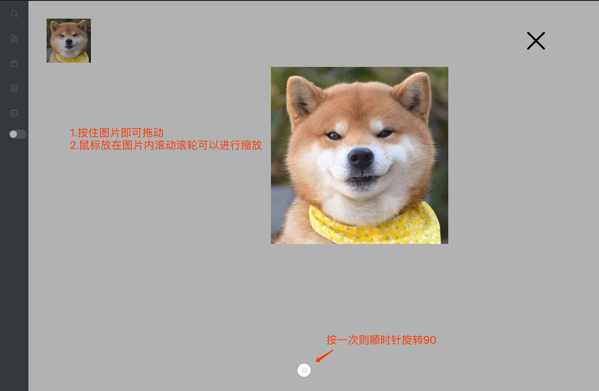

# image-viewer #

## 获取

	1.将插件包下载
	2.将imageViewer文件夹放到工程里

## 引用

  import ImageView from 'youpath/ImageView';

## 使用

  ```
   <ImageView full={true}>
        <!-- 只允许有一个标签，且必须为img -->
        
   </ImageView>
  ```
## 效果图/Rendering ##

